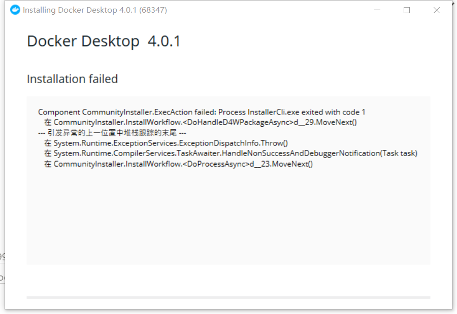

# Docker-制作本地深度学习镜像

Created: September 27, 2021 10:57 AM
Tags: Reading list

1. （windows10）docker的安装：
    1. 教程地址：[https://blog.csdn.net/qq_41723615/article/details/9279946](https://blog.csdn.net/qq_41723615/article/details/92799469)
    2. 下载和安装[Docker Desktop](https://www.docker.com/products/docker-toolbox)：
        - 安装路径不可以有中文。
        - 在select Additional Tasks的对最后一项打上钩
        - CMD查看是否安装成功，会出现版本信息
            
            ```bash
            docker-machine
            ```
            
        - 错误处理：
            - 服务器没有及时响应或控制请求
                - 解决方案1：系统设置——服务中找到并取消勾选 Power——应用并重启电脑（不行）
                - [解决方案2](https://blog.csdn.net/dbitc/article/details/105454023)：修改注册表，在cmd中regedit找到（不行）
                - 解决方案3：[安装docker toolbox](https://blog.csdn.net/tina_ttl/article/details/51372604、http://mirrors.aliyun.com/docker-toolbox/windows/docker-toolbox/)，不行，适合win7、8等
                - 最终解决：下载[历史版本3.2.0](https://docs.docker.com/desktop/windows/release-notes/)，可行
                
                
                
            - WSL版本过老，需要更新安装并重启：[https://blog.csdn.net/qq_39611230/article/details/108625840](https://blog.csdn.net/qq_39611230/article/details/108625840)
                
                
                
    3. 使用方法教程：[https://yeasy.gitbook.io/docker_practice/image/pull](https://yeasy.gitbook.io/docker_practice/image/pull)
        
        
        
2. 获取镜像
    1. 从Docker Hub中导入：
        
        ```bash
        $ docker pull [选项] [Docker Registry 地址[:端口号]/]仓库名[:标签]
        $ docker pull bitnami/tensorflow-serving 
        # 无地址则默认为官方镜像，IP或是 Docker Hub(docker.io)
        $ docker run -it --rm bitnami/tensorflow-serving bash # 运行，-i为交互式，-t为终端，--rm为容器推出后删除，bash为shell交互
        $ exit # 退出容器
        ```
        
    2. 配置镜像加速器：
        - 常见服务：
            - [阿里云加速器(点击管理控制台 -> 登录账号(淘宝账号) -> 右侧镜像工具 -> 镜像加速器 -> 复制加速器地址)](https://www.aliyun.com/product/acr?source=5176.11533457&userCode=8lx5zmtu)
            - [网易云加速器 `https://hub-mirror.c.163.com`](https://www.163yun.com/help/documents/56918246390157312)
            - [百度云加速器 `https://mirror.baidubce.com`](https://cloud.baidu.com/doc/CCE/s/Yjxppt74z#%E4%BD%BF%E7%94%A8dockerhub%E5%8A%A0%E9%80%9F%E5%99%A8)
        - [配置多个加速镜像](https://yeasy.gitbook.io/docker_practice/install/mirror)：任务栏docker图标右键——Setting——Docker Engine——编辑json文件——apply&restart
            
            ```bash
            {
              "registry-mirrors": [
                "https://hub-mirror.c.163.com",
                "https://mirror.baidubce.com",
            		"https://itn939va.mirror.aliyuncs.com"
              ]
            }
            
            # 检测是否生效
            $ docker info
            ```
            
    3. 查看镜像
        
        ```bash
        # 列出现有镜像及信息
        $ docker image ls
        $ docker image ls ubuntu # 根据名称
        # 删除虚悬镜像（升级安装镜像后遗留下的旧镜像）
        $ docker image prune
        $ docker image ls -q # 批量删除
        # 删除本地镜像
        $ docker image rm [选项] <镜像1> [<镜像2> ...]
        # 查看镜像内历史记录
        $ docker history
        ```
        
3. 制作镜像
    1. 基础：[命令参数](https://www.cnblogs.com/JMLiu/p/10277482.html)
        - docker run：该命令指定哪个镜像作为容器运行的基础。
            
            ```bash
            $ docker run --name webserver -d -p 80:80 nginx
            # 用nginx镜像启动一个容器，命名为webserver，映射到80端口，本地则是http://localhost即可访问
            # 如果是web服务，使用-d参数，在后台运行
            ```
            
        - docker exec：进入容器内部进行数据修改，如下展示修改页面。
            
            ```bash
            $ docker exec -it webserver bash
            root@3729b97e8226:/# echo '<h1>Hello, Docker!</h1>' > /usr/share/nginx/html/index.html
            root@3729b97e8226:/# exit
            exit
            ```
            
        - docker commit：黑箱生成镜像。将容器的存储层保存下来成为镜像，少用，因为难以修改其他文件，任何修改的结果仅仅是在当前层进行标记、添加、修改，而不会改动上一层。
            
            ```bash
            $ docker commit [选项] <容器ID或容器名> [<仓库名>[:<标签>]]
            $ docker commit \
                --author "Joven Chu <jovenchu@163.com>" \
                --message "修改了默认网页" \
                webserver \
                nginx:v2
            sha256:07e33465974800ce65751acc279adc6ed2dc5ed4e0838f8b86f0c87aa1795214
            ```
            
        - dockfile：开放式生成镜像，将镜像中所需要的安装、修改、运行等操作写入到脚本中。可以操作修改文件、安装软件包、编译构建等
            
            ```bash
            docker pull 镜像:tag                ##拉去默认仓库tag版本号的镜像
            docker images                       ##查询本地仓库的所有镜像
            docker rmi 镜像id                   ##删除镜像
            docker tag 镜像id 镜像:TAG          ##重命名镜像
            docker ps                           ##查询本地容器
            docker ps -a                        ##查询本地所有运行的容器
            docker export 容器id > x:/xx/xx.tar ##导出容器快照
            docker import - x:/xx/xx.tar        ##导入容器快照
            docker save 镜像id > x:/xx/xx.tar   ##导出镜像
            docker load < x:/xx/xx.tar          ##导入镜像
            ```
            
    2. 使用Dockerfile引用现有镜像进行定制步骤：
        1. 空白目录下创建[dockerfile](https://blog.csdn.net/qqqqqq654/article/details/78565127)和镜像的文件，测试FROM和RUN命令
            
            ```bash
            $ mkdir docker_file
            $ cd docker_file
            $ mkdir mynginx_0922
            $ cd mynginx_0922
            $ echo test> Dockerfile
            # 打开并写入应用的镜像和定制的信息
            $ notepad Dockerfile&
            
            FROM nginx
            RUN echo '<h1>Hello, Docker!</h1>' > /usr/share/nginx/html/index.html
            ```
            
        2. 使用 FROM 命令来指定基础镜像，先去[Docker Hub](https://hub.docker.com/)搜索并命令下载所需镜像，如：docker pull python；还可以通过 FROM scratch 命令创建空白虚拟镜像，无任何系统，适合linux，体积小但麻烦。
        3. docker run直接启动容器，以及进行内容修改
            
            ```bash
            # 已有镜像
            RUN echo '<h1>Hello, Docker!</h1>' > /usr/share/nginx/html/index.html
            # 空白镜像，逐层写入，Union FS 是有最大层数限制的，比如 AUFS，曾经是最大不得超过 42 层，现在是不得超过 127 层。
            FROM debian:stretch
            RUN set -x; buildDeps='gcc libc6-dev make wget' \
                && apt-get update \
                && apt-get install -y $buildDeps \
                && wget -O redis.tar.gz "http://download.redis.io/releases/redis-5.0.3.tar.gz" \
                && mkdir -p /usr/src/redis \
                && tar -xzf redis.tar.gz -C /usr/src/redis --strip-components=1 \
                && make -C /usr/src/redis \
                && make -C /usr/src/redis install \
                && rm -rf /var/lib/apt/lists/* \
                && rm redis.tar.gz \
                && rm -r /usr/src/redis \
                && apt-get purge -y --auto-remove $buildDeps
            ```
            
        4. 构建镜像，build命令构建
            
            ```bash
            # 最后一个.表示当前目录
            $ docker build -t nginx:v3 .
            Sending build context to Docker daemon 2.048 kB
            Step 1 : FROM nginx
             ---> e43d811ce2f4
            Step 2 : RUN echo '<h1>Hello, Docker!</h1>' > /usr/share/nginx/html/index.html
             ---> Running in 9cdc27646c7b
             ---> 44aa4490ce2c
            Removing intermediate container 9cdc27646c7b
            Successfully built 44aa4490ce2c
            ```
            
        5. 运行，打开地址：http://localhost:81/
            
            ```bash
            $ docker run --name web3 -d -p 81:80 nginx:v3
            ```
            
    3. 用本机的Dockerfile文件创建一个[项目镜像](https://www.jianshu.com/p/fe81ca1bccc6)
        1. 定制centos7的python3.6基础镜像
            
            ```bash
            $ cd Documents/docker_file
            $ mkdir python36
            $ cd python36
            $ echo test> Dockerfile
            # 下载centos基础镜像
            docker pull centos:7.5.1804
            # 打开并写入应用的镜像和定制的信息
            $ notepad Dockerfile&
            #################################################################################################################
            # 完整功能python3 joven/python:3.6.10-centos
            FROM centos:7.5.1804
            MAINTAINER joven jovenchu@163.com
             
            ENV PATH $PATH:/usr/local/python3/bin/
            ENV PYTHONIOENCODING utf-8
             
            RUN set -ex \
            	# 替换yum源为国内阿里云，加快下载速度
            	&& mv /etc/yum.repos.d/CentOS-Base.repo /etc/yum.repos.d/CentOS-Base.repo.backup \ 
            	&& curl -o /etc/yum.repos.d/CentOS-Base.repo http://mirrors.aliyun.com/repo/Centos-7.repo \
            	&& sed -i -e '/mirrors.cloud.aliyuncs.com/d' -e '/mirrors.aliyuncs.com/d' /etc/yum.repos.d/CentOS-Base.repo \	
            	# 安装python依赖库
            	&& yum makecache \
            	&& yum -y install zlib-devel bzip2-devel openssl-devel ncurses-devel sqlite-devel readline-devel tk-devel gcc make wget \
            	&& yum clean all \
            	&& rm -rf /var/cache/yum \
            	# 下载安装python3，按需选择合适的安装包
            	&& wget https://www.python.org/ftp/python/3.6.10/Python-3.6.10.tgz \
            	&& mkdir -p /usr/local/python3 \
            	&& tar -zxvf Python-3.6.10.tgz \
            	&& cd Python-3.6.10 \
            	&& ./configure --prefix=/usr/local/python3 \
            	&& make && make install && make clean \
            	# 修改pip默认镜像源
            	&& mkdir -p ~/.pip \
            	&& echo '[global]' > ~/.pip/pip.conf \
            	&& echo 'index-url = https://pypi.tuna.tsinghua.edu.cn/simple' >> ~/.pip/pip.conf \
            	&& echo 'trusted-host = pypi.tuna.tsinghua.edu.cn' >> ~/.pip/pip.conf \
            	&& echo 'timeout = 120' >> ~/.pip/pip.conf \
            	# 更新pip
            	&& pip3 install --upgrade pip \
            	# 安装wheel
            	&& pip3 install wheel \
            	# 删除安装包
            	&& cd .. \
            	&& rm -rf /Python* \
            	&& find / -name "*.py[co]" -exec rm '{}' ';' \
            	# 设置系统时区
            	&& rm -rf /etc/localtime \
            	&& ln -s /usr/share/zoneinfo/Asia/Shanghai /etc/localtime
            #################################################################################################################
            
            # 运行构建镜像,在python36目录下
            docker build -t centosjoven .
            
            # 进入容器查看，退出删除
            $ docker run --name python36 -it --rm centosjoven:latest
            ```
            
            
            
        2. 或者搜索基础镜像并下载，查看
            
            ```bash
            $ docker search python
            $ docker pull centos/python-36-centos7
            $ docker images
            
            # 在nvidia的docker专区下载：https://hub.docker.com/r/nvidia/cuda，在tag界面搜索11.0.3
            $ docker pull nvidia/cuda:11.0.3-cudnn8-runtime-centos7
            $ docker images
            ```
            
        3. 创建带有ssh和jupyter的dockerfile
            
            ```bash
            $ cd docker_file
            $ mkdir python36
            $ cd python36
            $ echo test> Dockerfile
            # 打开并写入应用的镜像和定制的信息
            $ notepad Dockerfile&
            #################################################################################################################
            # 设置基础镜像
            FROM nvidia/cuda:11.0.3-cudnn8-runtime-centos7
            MAINTAINER jovenchu
            
            # 安装 openssh 和 openssl
            RUN set -ex \
            	&& yum install -y openssh-clients openssh-server openssl \
            	&& mkdir -p /var/run/sshd \
            	&& /usr/bin/ssh-keygen -A
                
            # 允许 OpenSSH 在不要求确认的情况下与容器通信
            RUN set -ex \
            	&& cat /etc/ssh/ssh_config | grep -v StrictHostKeyChecking > /etc/ssh/ssh_config.new \
            	&& echo "    StrictHostKeyChecking no" >> /etc/ssh/ssh_config.new \
            	&& cat /etc/ssh/sshd_config | grep -v  PermitRootLogin> /etc/ssh/sshd_config.new \
            	&& echo "PermitRootLogin yes" >> /etc/ssh/sshd_config.new \
            	&& mv /etc/ssh/ssh_config.new /etc/ssh/ssh_config \
            	&& mv /etc/ssh/sshd_config.new /etc/ssh/sshd_config
            
            # 开始安装python3
            ## 设定python版本
            ARG python=3.6.10
            ENV PYTHON_VERSION=${python} 
            
            RUN yum clean packages \
            	&& yum -y install wget make zlib zlib-devel bzip2-devel openssl-devel sqlite-devel readline-devel gdbm-devel  gcc libffi-devel \ 
            	&& cd /home \
            	&& wget https://www.python.org/ftp/python/${PYTHON_VERSION}/Python-${PYTHON_VERSION}.tgz \
            	&& tar -zxvf Python-${PYTHON_VERSION}.tgz \
            	&& cd Python-${PYTHON_VERSION} \
            	&& ./configure \
            	&& make \
            	&& make install \
            	&& make clean \
            	&& rm -rf Python-${PYTHON_VERSION}
            
            ## 安装 python3
            RUN set -ex \
            	&& if [ -e /usr/bin/python ]; then mv /usr/bin/python /usr/bin/python27; fi \
                && if [ -e /usr/bin/pip ]; then mv /usr/bin/pip /usr/bin/pip-python27; fi \
                && ln -s /usr/local/bin/python3 /usr/bin/python \
                && ln -s /usr/local/bin/pip3 /usr/bin/pip \
                # 修改pip默认镜像源
            	&& mkdir -p ~/.pip \
            	&& echo '[global]' > ~/.pip/pip.conf \
            	&& echo 'index-url = https://pypi.tuna.tsinghua.edu.cn/simple' >> ~/.pip/pip.conf \
            	&& echo 'trusted-host = pypi.tuna.tsinghua.edu.cn' >> ~/.pip/pip.conf \
            	&& echo 'timeout = 120' >> ~/.pip/pip.conf \
            	# 更新pip
            	&& pip3 install --upgrade pip \
            	# 安装wheel
            	&& pip3 install wheel
            
            # 验证环境信息，修改环境配置
            RUN set -ex \
                && sed -i "s#/usr/bin/python#/usr/bin/python2.7#" /usr/bin/yum \
                && if [ -e /usr/libexec/urlgrabber-ext-down ]; then sed -i "s#/usr/bin/python#/usr/bin/python2.7#" /usr/libexec/urlgrabber-ext-down; fi
            # 完成 python3 安装工作
            
            # 安装jupyterlab
            RUN set -ex \
            	&& pip install --upgrade pip \
            	&& pip --no-cache-dir install jupyterlab \
            	&& rm -rf /root/.cache/pip/http/*  
            
            ## 确认jupyterlab安装完成
            RUN set -ex \
            	&& mkdir /etc/jupyter/ \
            	&& wget -P /etc/jupyter/  https://raw.githubusercontent.com/Winowang/jupyter_gpu/master/jupyter_notebook_config.py \
            	&& wget -P /etc/jupyter/ https://raw.githubusercontent.com/Winowang/jupyter_gpu/master/custom.js 
            
            ## 安装tini，使得容器可被集群K8s调用：https://blog.csdn.net/M2l0ZgSsVc7r69eFdTj/article/details/104765016
            ENV TINI_VERSION v0.18.0
            ADD https://github.com/krallin/tini/releases/download/${TINI_VERSION}/tini /tini
            # 解决 net/http: TLS handshake timeout的错误需要添加镜像源，中间报错可删除第二行，再次运行。
            RUN set -ex \
                && curl -sSL https://get.daocloud.io/daotools/set_mirror.sh | sh -s http://d1d9aef0.m.daocloud.io \
                && chmod +x /tini
            #################################################################################################################
            
            # 运行构建镜像,在python36目录下
            docker build -t jovenchu/python36:cuda11.0.3-cudnn8-ssh-jupyter .
            
            # 进入容器查看，退出删除
            $ docker run --name python36 -it --rm jovenchu/python36:cuda11.0.3-cudnn8-ssh-jupyter
            ```
            
        4. 导出该环境下所有的程序依赖包及其版本，需要注意[删除部分](https://stackoverflow.com/questions/62885911/pip-freeze-creates-some-weird-path-instead-of-the-package-version)conda的包，以免报错conda的包装不上，没有路径等情况报错
            
            ```bash
            $ pip freeze > requirements.txt
            # 为避免程序臃肿，更建议手动选择项目所需的包
            ```
            
        5. 创建项目的dockfile
            
            ```bash
            $ cd Documents/docker_file
            $ mkdir classifier_seq2seq
            $ cd classifier_seq2seq
            $ echo test> Dockerfile
            # 打开并写入应用的镜像和定制的信息
            $ notepad Dockerfile&
            
            # 基于的基础镜像
            FROM jovenchu/python36:cuda11.0.3-cudnn8-ssh-jupyter
            # 维护者信息
            MAINTAINER joven  jovenchu@163.com
            # 代码添加到code文件夹
            ADD ./project /code
            # 设置code文件夹是工作目录
            WORKDIR /code
            # 安装python包支持
            RUN set -xe \
                && yum -y update \
                && yum -y install python-pip
            RUN pip install --upgrade pip
            RUN pip install -r requirements.txt
            ```
            
        6. 制作项目镜像
            
            ```bash
            # $ docker build -t imagename Dockerfilepath 
            # Dockerfilepath：Dockerfile 所在文件夹名称，当前名录为 “.” 
            $ docker build -t classifierseq2seq .
            ```
            
        7. 运行项目镜像，进行训练测试，通过
            
            ```bash
            $ docker run --name seq2seq -it --rm classifierseq2seq
            $ pip list
            $ python3 train.py
            ```
            
        8. 导出镜像和容器
            
            ```bash
            # 导出容器
            $ docker export 0b60f02b3dde > ./container/seq2seq.tar
            # 导出镜像
            $ docker save 0b60f02b3dde > ./container/seq2seq.tar
            # 上传到dockerhub中需要先修改tag，镜像前需要加上本人docker用户名
            $ docker tag ae808ebf2f51 jovenchu/python36:latest
            $ docker push jovenchu/python36
            # 更新
            $ docker commit -m="centos7 + nvidia-smi" -a="jovenchu" centos_cuda  jovenchu/centos_cuda
            
            ```
            
4. 导入镜像
    1. 以在浪潮AI Station为例：导入方式分为内部tar文件导入和外部的docker hub连接导入。
        - 其中内部导入，需要通过ssh或sftp的方式，将制作好的image save后的tar文件导入到【文件管理用户目录】，然后在下面【选择镜像】的时候找到该压缩文件。
            
            
            
        - 外部导入：需要使用命令 docker pull + 【push后的镜像名】
        - 导入完成后，在开发环境中选择使用即可。
            - 遇到jupyter notebook无法启动问题
                
                ```bash
                $ cd /etc/jupyter/
                $ vi jupyter_notebook_config.py
                # 找到 #c.NotebookApp.allow_root = False ，去掉#，并修改为True。一般没有就新增c.NotebookApp.allow_root = True
                $ jupyter notebook
                # 截至目前可以启动jupyter，但是因为浪潮的服务并不匹配，无法进行页面的编辑，问题在联系浪潮方检查修复中。
                ```
                
    2. 除项目镜像，以上制作的docker已上传至百度云盘，或在docker hub搜索，均可供下载使用。
    3. 说明：从制作镜像的第3步开始，dockerfile就是按照浪潮AI Station的服务格式进行编写的了，如果只是用于终端或服务器运行及部署项目，可以选择不安装jupyter
5. 创建Flask服务
    1. 基于本地docker容器：制作小且满足服务的docker，实现对联项目的flask服务即可
        
        ```bash
        # 1.生成依赖库，选择项目必须的，减少docker制作时间
        cd chinese_couplet
        pip freeze > requirements.txt
        
        # 2.形成web文件目录
        # 将原有的文件和代码封装在project\app的路径中，其中demo.py封装了模型的预测推理服务和主页面
        # 新建__init__.py和run.py进行服务的调用，参考chinese_couplet目录进行设置
        # 新建chinese_couplet.wsgi，用于在我们的实例Apache服务器中，包含了连接Python代码和web服务器的指令
        
        # 创建基础的python_web镜像，基于ubuntu-python3.6，也可以使用上面的centos的python镜像，dockerfile参考目录中
        # 注意此次最容易踩坑，一般安装ubuntu:18.04版本，16太低无法dockerfile安装python3.6，最新的ubuntu默认python3.8，容易在pip安装和运行代码过程中出错。具体要看项目所用的python和依赖库组件的版本
        cd  python_webapp-images
        docker build -t webappflask .
        
        # 创建项目的镜像，dockerfile参考目录中，安装了基础的tensorflow、sklearn等框架。
        cd ../
        docker build -t jovenchu/flask_couplet .
        
        # 运行docker并访问网页端，运行run.py将启动Python的带调试的web服务器并监听所有连接，我们也能从容器外访问；如果编辑在主机（服务器）上的源程序，就能马上看到网页上的改变。
        docker run -p 5000:5000 -v "%cd%"/chinese_couplet:/opt/chinese_couplet/ -it --rm jovenchu/flask_couplet python3 project/run.py
        
        ```
        
        - 文件目录（win下打印树结构命令：tree /F）：项目参考文章：[Flask Mega-Tutorial 中文教程 V2.0 第1章：Hello，World！](https://blog.csdn.net/gh254172840/article/details/81409498)
            
            ```bash
            ├──chinese-couplet # 总文件
            	  │  chinese-couplet.wsgi # 用于在我们的实例Apache服务器中，包含了连接Python代码和web服务器的指令
            		│  Dockerfile # 创建项目的镜像文件
            		│  requirements.txt # 项目所需的python依赖库
            		├─project # 项目代码
            		│  ├─ run.py # Flask 应用程序实例的运行脚本，这将启动Python的带调试的web服务器并监听所有连接，我们也能从容器外访问
            		│  ├─ __init__.py # 空，仅调用
            		│  ├─app
            		│  │  │  bleu.py
            		│  │  │  couplet.py
            		│  │  │  demo.py # 模型推理服务的调用主逻辑脚本
            		│  │  │  model.py
            		│  │  │  reader.py
            		│  │  │  README.md
            		│  │  │  seq2seq.py
            		│  │  │  server.py
            		│  │  │  test.py
            		│  │  │  __init__.py # 用于初始化app实例，并调用demo.py
            		│  │  │
            		│  │  ├─data
            		│  │  ├─Demo
            		│  │  ├─models # 模型训练结果
            		│  │  │  └─output_couplet
            		│  │  ├─static
            		│  │  │  ├─assets
            		│  │  │  └─images
            		│  │  ├─templates
            		│  │  │      elements.html
            		│  │  │      generic.html
            		│  │  │      index.html
            		│  │  │      LICENSE.txt
            		└─python_webapp-images # 创建基础的python_web镜像
            
            ```
            
        - 使用服务：
            - 成功标志：
                
                
                
                
                
            - 提示使用【[http://172.17.0.2:5000/Chinese_Couplet](http://192.168.86.1:5000/Chinese_Couplet)】访问，如果是本机运行docker，但是需要使用【ipconfig】命令查询得到以太网适配器 VMware Network Adapter第一个的IPv4地址，修改后再重新访问即可【[http://192.168.86.1:5000/Chinese_Couplet](http://192.168.86.1:5000/Chinese_Couplet)】，成功访问的页面和后台如下所示（效果因模型而异）：
                
                
                
                
                
    2. 基于浪潮AI Staion：
        1. 开放北向接口
            
            ```bash
            # 查看端口是否放开，返回被监听则是放开，否则执行命令
            netstat  -anp  |grep 32002
            # 放开端口
            firewall-cmd --zone=public --add-port=32002/tcp --permanent
            firewall-cmd --reload
            
            # 修改文件，将swagger的值改为NON_NI_HIDDEN
            vi /etc/aistation/configfiles/application.yml
            
            # 重启业务模块
            cd /var/lib/aistation/aistation2.0_modules/ibase
            bash deploy.sh 
            cd /var/lib/aistation/aistation2.0_modules/istorage/
            bash deploy.sh 
            cd /var/lib/aistation/aistation2.0_modules/iresource/
            bash deploy.sh 
            cd /var/lib/aistation/aistation2.0_modules/imonitor/
            bash deploy.sh 
            
            # 验证：访问https://10.74.149.11:32002/swagger-ui.html
            ```
            
        2. 在开发环境中进行测试
            - 新建开发环境，在更多选项——设置端口，这里写代码服务中的端口，我是5000
                
                
                
            - 进入环境中，修改demo.py的路径（服务器用绝对路径），运行服务代码run.py
            - 在容器实例中找到端口5000映射后的端口，我这次是30957
                
                
                
            - 修改IP为浪潮平台部署的地址，并且修改访问协议为http（flask代码中），即可访问。
6. 说明
    - 除项目镜像，以上制作的docker、完整的项目代码已上传至百度云盘，或在docker hub搜索，均可供下载使用。
        - 地址：
        - 验证码：
    - 说明：从制作镜像的第3步开始，dockerfile就是按照浪潮AI Station的服务格式进行编写的了，如果只是用于终端或服务器运行及部署项目，可以选择不安装jupyter